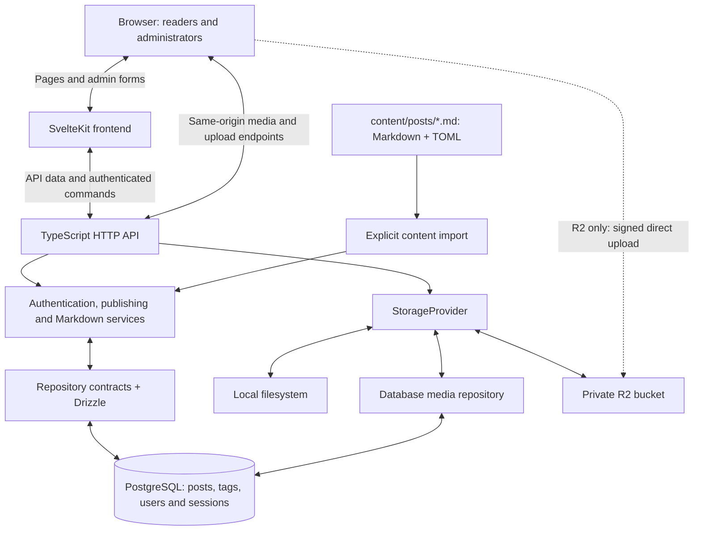

<!-- @file README.md -->
<!-- @brief Project overview, features, quick start, and documentation map. -->

# BenchCore

**Bench-testing, Embedded Networks, & Circuit Hacks: Centralized Open-source Research Engine**

**Markdown authoring. PostgreSQL publishing. An engineering-log interface.**

BenchCore is a self-hosted research publishing platform with a SvelteKit frontend and a
standalone TypeScript API. Write Markdown with TOML frontmatter, connect notes
with Obsidian-style `[[wikilinks]]`, and publish through a session-protected
admin editor. PostgreSQL is the runtime source of truth; the frontend never
reads the database or the authoring directory.

License: **AGPL-3.0-or-later** · Runtime: **Node.js 24** · Package manager:
**pnpm 10.15.0** · Release target: **0.7.0**

## One origin

The production runtime combines frontend and backend into one Node service.
Pages and `/api/*` share the same domain and port. Run `pnpm build`, configure
the database and trusted origin, then run `pnpm start` on port **5180**.
`/register` creates readers only; `/account` changes passwords; `/admin/users`
manages accounts and protects the final active administrator.

[Node deployment](docs/BETA_DEPLOYMENT.md) covers the unified Node artifact,
GitHub CI/CD, HTTPS hosting, explicit migrations, backups and release limits.
No GHCR/container images are required. **GitHub Pages cannot run the backend.**

[Vercel deployment](docs/VERCEL_DEPLOYMENT.md) runs independently built frontend
and API services in one project/domain, with a private runtime binding and R2
browser-direct uploads. Scheduled publication
is temporarily disabled on that target; the persistent Node runtime remains available.

## Features

- **Markdown + TOML** — `+++` frontmatter, validated metadata, sanitized HTML,
  tables, code blocks, images, excerpts, and reading-time estimates.
- **Wikilinks & backlinks** — `[[slug]]` and `[[slug|label]]` link notes;
  backlinks show only visible source posts. Hover or focus a wikilink or graph
  node for a session-aware preview. The reader includes a heading index.
- **Public publishing** — home, paginated posts, post detail, tags, and tag
  archives. Draft, archived, and not-yet-public content stays out of public data.
- **Search** — `GET /api/posts?search=...`; PostgreSQL generated `tsvector`
  with the `simple` configuration and a GIN index. Combine tags with AND/OR and
  sort by publication, updates or existing likes. Editor suggestions match
  fuzzy titles, slugs and tags.
- **Admin workbench** — session-protected deck, create/edit/delete posts,
  write/preview modes, comma-separated tags, and image uploads.
- **Publishing lifecycle** — draft, published, archived; publication timestamps
  and a separate scheduled `publishAt` value in the API/admin. The 0.5.0 due
  publication job runs approximately once per minute.
- **Media storage seam** — `StorageProvider` isolates callers from the backend;
  `MEDIA_STORAGE=local|database|r2` selects filesystem images, database blobs or private R2.
  R2 batches have immediate previews, measured upload progress and attachment
  reordering. `pnpm media:cleanup` reports orphan counts without deleting;
  apply mode requires an explicit maintenance acknowledgement.
- **Authentication** — scrypt password hashes, random session tokens, hashed
  tokens at rest, HttpOnly cookies, SameSite=Lax, and Secure production cookies.
- **Database accounts** — username/email login; provision an administrator through
  private stdin with `pnpm user:create`, without storing account credentials in `.env`.
- **Security hardening** — exact Origin allowlists, bounded in-memory rate
  limits, response security headers, and frontend Content Security Policy in
  the 0.5.0 milestone.
- **SEO & feeds** — canonical URLs, metadata, sitemap, RSS, and robots routes.
- **Three themes** — light, dark, and OLED; CSS tokens, persisted preference,
  and a pre-paint script to reduce theme flashes.
- **Self-hosting** — one Node service for frontend and API, with PostgreSQL;
  explicit migrations, admin bootstrap, and repeatable content import.
- **Quality gates** — Vitest suites, frontend/API typechecks, frontend lint,
  and production builds; CI runs the same checks.
- **No application telemetry** — no built-in analytics, tracking SDKs, or
  third-party trackers. Hosts and reverse proxies can still log requests.

**Scope:** 0.7.0 is prepared locally, not a published package or a
promise of a hosted service. Revision storage is groundwork only: no automatic
revision capture, history browser, diff, or restore workflow is claimed.
Basic moderated comments and anonymous likes are implemented. Advanced anti-spam,
MFA, revision workflows and other deferred features are not claimed.
See [TODO.md](TODO.md) for milestone status.

For release checks and the remaining operator gates, see
[0.7.0 release preparation](docs/RELEASE_0.7.0.md). `pnpm release:check`
validates workspace versions; `pnpm release:package` builds the versioned Node
bundle after `pnpm build`. Neither command tags, publishes or deploys.

## Run it

Prerequisites: Node.js 24, pnpm 10.15.0, and PostgreSQL 17.

```sh
git clone https://github.com/camiu01/BenchCore.git
cd BenchCore
pnpm install --frozen-lockfile
```

If pnpm is not installed, use `npx --yes pnpm@10.15.0` in place of `pnpm`
throughout the commands below. Do not substitute an unpinned `pnpm@latest`.

To see the public interface without PostgreSQL, run `pnpm demo:api` and
`pnpm dev:frontend` in separate terminals. The preview uses synthetic public
notes and keeps authored drafts private. Set `ADMIN_USERNAME` and
`ADMIN_PASSWORD` in the preview process environment to create an optional
in-memory administrator. See [Development](docs/DEVELOPMENT.md).

### Local development

Copy `.env.example` to `.env`, set development-only database/admin values, and
load the required variables into the processes you launch. A root `.env` is a
reference file, not a guarantee that every CLI loads it automatically.
See [Development](docs/DEVELOPMENT.md) for PowerShell and POSIX setup.

```sh
pnpm db:migrate
pnpm seed
pnpm dev:api
```

The API development command runs
`tsx watch --env-file-if-exists=../.env src/index.ts` from `api/`.
The `watch` subcommand must precede Node flags; otherwise Node treats
`watch` as a filename instead of starting the file watcher.

In another terminal, with the same relevant environment:

```sh
pnpm dev:frontend
```

Open `http://localhost:5173`; the API listens on `http://localhost:5181`.
If your database already has an operator account, skip `pnpm seed` and sign in.
To create an account without importing posts, use `pnpm user:create` as described
in [Operations](docs/OPERATIONS.md). Sign in at `/login`, then open `/admin`. Set `SITE_URL` and
`PUBLIC_SITE_URL` to `http://localhost:5173` for local development.

### Production Node service

```sh
pnpm build
pnpm beta:migrate
pnpm start
```

Configure `.env` with the intended PostgreSQL connection and trusted `SITE_URL`
before applying migrations. Pages and `/api/*` share port **5180**.
Admin creation is an explicit operation, not part of startup.
Use [Beta deployment](docs/BETA_DEPLOYMENT.md) for artifact installation,
production settings and account provisioning.

### Checks

```sh
pnpm --filter benchcore-api exec tsc --noEmit
pnpm check
pnpm test
pnpm lint
pnpm build
```

## How it works



1. A reader opens a page. SvelteKit asks the API for visible posts, and the
   API queries PostgreSQL through repositories. The frontend receives API data,
   never a database connection. Drafts and archived posts remain private;
   reader-only bodies require a reader or administrator session.
2. An administrator signs in and edits a post. The API checks the session and
   trusted Origin, validates metadata, sanitizes rendered Markdown and saves
   through the repositories. Preview renders HTML without saving the post.
3. Markdown files enter the database only through an explicit import. Import
   parses TOML, validates fields and applies the same publishing pipeline.
   Editing a file does not update the running site until it is imported.
4. Images use the configured storage provider. Local and database uploads pass
   through the API. For R2, the API authorizes an upload, the browser sends the
   image directly to R2, and the API validates completion before accepting
   its managed URL.

The diagram shows logical boundaries. Development uses frontend port **5173**
and API port **5181**; the production Node runtime serves pages and `/api/*`
through one origin on port **5180**.

## Publishing engine

| Layer | Responsibility |
|---|---|
| `api/src/markdown/` | Split `+++` fences, parse TOML, validate with Zod, render and sanitize Markdown |
| `api/src/posts/` | Publishing rules, timestamps, slug conflicts, imports, public DTOs |
| `api/src/db/` | Repository contracts, memory test doubles, Drizzle implementations and schema |
| `api/src/auth/` | Password verification, token generation, session hashing and cookies |
| `api/src/media/` | Swappable image storage behind `StorageProvider` |
| `api/src/server.ts` | HTTP boundary and routing; services own business rules |
| `frontend/src/lib/` | Server-only API clients, SEO URL helpers, components, theme state |
| `frontend/src/routes/` | Public pages, authentication, guarded admin, feeds and metadata routes |

The database and uploaded media contain runtime state. Import is a deliberate
upsert by slug, not a live filesystem watcher or two-way editor synchronization.
Re-importing a file can overwrite later admin edits.

## Structure

```text
content/posts/                  # Markdown + TOML authoring source
api/
  src/auth/                     # scrypt passwords and token sessions
  src/db/                       # contracts, schema, Drizzle, memory repos
  src/markdown/                 # frontmatter validation and safe rendering
  src/posts/                    # publishing, CRUD, import
  src/media/                    # StorageProvider and backend implementations
  src/server.ts                 # standalone node:http API
  src/index.ts                  # dependency wiring and boot
  scripts/                      # migration, seed, content import
  drizzle/                      # committed SQL migrations
  tests/                        # Vitest suites
frontend/
  src/lib/components/           # document shell, SEO, theme picker, editor
  src/lib/server/               # authenticated server-only API client
  src/routes/                   # public pages, login/logout, admin, feeds
  src/app.css                   # theme tokens and spec-sheet design
  src/app.html                  # page shell and pre-paint theme script
  tests/                        # Vitest suites
docs/                           # developer, author, API, operations guides
.github/                        # CI and contribution templates
runtime/                        # unified production Node listener
scripts/                        # allowlisted packaging and isolated SQL smoke
TODO.md                         # milestone roadmap
```

## Design system

An engineering-log spec sheet: monospace typography, blueprint grid, bordered
sheet with a hard shadow, record cards, stamp badges, and inventory tables.
Themes use `data-theme` and CSS variables rather than independent page palettes.
Preference lives in localStorage under `site-theme`; it is not an analytics
identifier. See [Admin & themes](docs/ADMIN_AND_THEMES.md).

## Key decisions

1. Separate frontend and API so deployments and storage boundaries stay explicit.
2. Plain `node:http` rather than a web framework for a compact API.
3. TOML `+++` fences avoid confusion with Markdown horizontal rules.
4. PostgreSQL owns published runtime data; Markdown remains a portable source.
5. Services own publishing visibility; unpublished slugs always mask as 404.
6. HTML is sanitized before it reaches a page or editor preview.
7. Repository interfaces keep unit tests independent of a live database.
8. Media callers use an interface, never filesystem paths or blob SQL.
9. SvelteKit 3 configuration lives in `vite.config.ts`; relative imports and
   server-only `process.env` keep tooling and secret boundaries predictable.
10. Dependencies are pinned; pnpm's lockfile is part of the reproducible build.

## Documentation

| Guide | Contents |
|---|---|
| [Documentation index](docs/README.md) | Suggested reading paths and scope |
| [Architecture](docs/ARCHITECTURE.md) | Data flow, module boundaries, database, trust boundaries |
| [Development](docs/DEVELOPMENT.md) | Prerequisites, shell setup, environment, commands |
| [Authoring](docs/AUTHORING.md) | TOML fields, Markdown, links, import, scheduling |
| [API](docs/API.md) | Routes, payloads, cookies, Origin, search, media, errors |
| [Admin & themes](docs/ADMIN_AND_THEMES.md) | Editorial workflow, image handling, design tokens |
| [Operations](docs/OPERATIONS.md) | Deployment, migrations, backup/restore, incident checks |
| [Testing](docs/TESTING.md) | Automated checks, regression coverage, manual smoke tests |
| [Troubleshooting](docs/TROUBLESHOOTING.md) | Common setup and runtime failures |
| [Contributing](CONTRIBUTING.md) | Workflow, conventions, PR checklist |
| [Security policy](SECURITY.md) | Private reporting, privacy, supported scope |
| [Threat model](docs/THREAT_MODEL.md) | Assets, attackers, controls, operational limitations |

## License

Maintained by **Camiu** ([@camiu01](https://github.com/camiu01)).
GNU Affero General Public License v3.0 (AGPL-3.0-or-later) — see [LICENSE](LICENSE).
